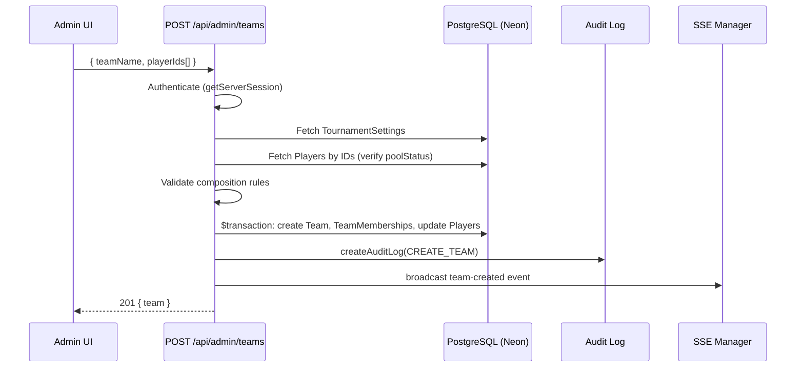
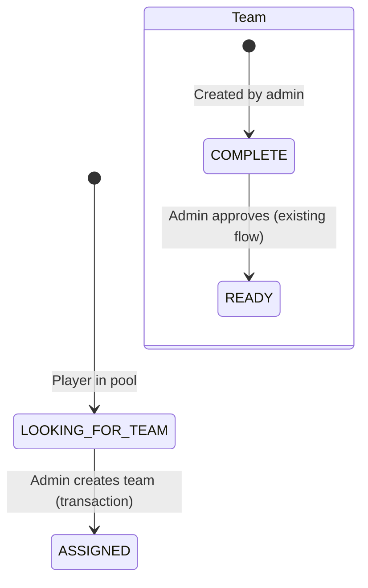

# Design Document: Admin Team Creation from Individual Player Pool

## Overview

This feature adds an API endpoint and admin UI section that allows administrators to create cricket teams by selecting players from the individual player pool (`poolStatus = LOOKING_FOR_TEAM`). The admin provides a team name and selects players that satisfy tournament constraints. The system atomically creates the team, assigns memberships, and updates player statuses within a single Prisma transaction.

The design reuses existing models (Team, Player, TeamMembership, TournamentSettings) without schema changes, follows established patterns from the captain creation and team approval flows, and integrates with the existing admin panel UI.

## Architecture



### Key Architectural Decisions

1. **Single new API route** (`POST /api/admin/teams`): Keeps the endpoint focused. The GET for pool players can be served by the existing `/api/admin/pending` endpoint or a lightweight query in the same route.

2. **No schema changes**: Uses existing `CREATE_TEAM` audit action, `DRAFT_PICK` membership type, and `COMPLETE` team status — all already in the schema.

3. **Transaction-based atomicity**: All mutations (team creation, membership creation, player status updates) happen in a single `prisma.$transaction()` call, matching the pattern in `registration.ts`.

4. **Frontend integration**: Adds a new tab/section to the existing admin page rather than a separate page, keeping navigation simple.

## Components and Interfaces

### API Endpoint

**`POST /api/admin/teams`** — Create a team from pool players

Request body:
```typescript
{
  teamName: string;       // 2-100 chars, unique
  playerIds: string[];    // UUIDs of pool players
}
```

Response (201):
```typescript
{
  team: {
    id: string;
    name: string;
    status: "COMPLETE";
    memberCount: number;
  }
}
```

Error responses:
- `400` — Validation failure (name length, composition rules, non-pool players)
- `403` — Not authenticated as admin
- `409` — Team name already exists

**`GET /api/admin/teams/pool-players`** — Fetch available pool players and settings

Response (200):
```typescript
{
  players: {
    id: string;
    fullName: string;
    gender: "MALE" | "FEMALE";
    preferredRole: string;
    experienceLevel: string;
  }[];
  settings: {
    mandatoryPlayerCount: number;
    mandatoryFemaleCount: number;
    maxTeamSize: number;
  };
}
```

### Validation Schema (Zod)

```typescript
const adminCreateTeamSchema = z.object({
  teamName: z.string().min(2).max(100),
  playerIds: z.array(z.string().uuid()).min(1),
});
```

Server-side validation (after fetching settings and players):
- `playerIds.length >= settings.mandatoryPlayerCount`
- `playerIds.length <= settings.maxTeamSize`
- `femaleCount >= settings.mandatoryFemaleCount`
- All players have `poolStatus === LOOKING_FOR_TEAM`

### Frontend Component

A new section within the admin page (or a collapsible panel) with:
- Team name input field
- Searchable/filterable player list with checkboxes
- Real-time counter showing: selected count, female count, constraints
- Submit button (disabled until constraints are met)
- Success state showing the created team with a link to create captain credentials

## Data Models

No new models are introduced. The feature uses:

| Model | Usage |
|-------|-------|
| `TournamentSettings` | Read `mandatoryPlayerCount`, `mandatoryFemaleCount`, `maxTeamSize` |
| `Player` | Filter by `poolStatus = LOOKING_FOR_TEAM`, update to `ASSIGNED` |
| `Team` | Create with `status = COMPLETE`, `teamSize` from settings |
| `TeamMembership` | Create with `membershipType = DRAFT_PICK`, sequential `positionSlot` |
| `AuditLog` | Record `CREATE_TEAM` action with player IDs |

### State Transitions



## Correctness Properties

*A property is a characteristic or behavior that should hold true across all valid executions of a system — essentially, a formal statement about what the system should do. Properties serve as the bridge between human-readable specifications and machine-verifiable correctness guarantees.*

### Property 1: Pool player filtering

*For any* set of players in the database with varying `poolStatus` values, the pool players endpoint SHALL return only players whose `poolStatus` equals `LOOKING_FOR_TEAM`, and no others.

**Validates: Requirements 1.3**

### Property 2: Team name length validation

*For any* string input as a team name, the system SHALL accept it if and only if its trimmed length is between 2 and 100 characters inclusive.

**Validates: Requirements 2.1**

### Property 3: Team name uniqueness

*For any* team name that already exists in the database, attempting to create a new team with that same name SHALL result in a conflict error, regardless of the player selection.

**Validates: Requirements 2.2**

### Property 4: Team composition validation

*For any* set of player selections and tournament settings, the system SHALL reject team creation if any of the following hold: (a) the number of selected players is less than `mandatoryPlayerCount`, (b) the number of FEMALE players in the selection is less than `mandatoryFemaleCount`, (c) the number of selected players exceeds `maxTeamSize`, or (d) any selected player has a `poolStatus` other than `LOOKING_FOR_TEAM`. Conversely, if none of these conditions hold, the system SHALL accept the creation.

**Validates: Requirements 3.2, 3.3, 4.1, 4.2, 4.3**

### Property 5: Team creation state invariants

*For any* valid team creation request (satisfying all composition rules), after successful creation: (a) the team record SHALL have the exact name provided, (b) the team status SHALL be `COMPLETE`, (c) every selected player SHALL have exactly one `TeamMembership` with `membershipType = DRAFT_PICK`, (d) every selected player's `poolStatus` SHALL be `ASSIGNED`, and (e) position slots SHALL be assigned sequentially as "Player 1" through "Player N".

**Validates: Requirements 2.3, 5.1, 5.2, 5.3, 5.5**

### Property 6: Audit log correctness

*For any* successful team creation, the system SHALL create exactly one audit log entry with `action = CREATE_TEAM`, `actorUserId` equal to the authenticated admin's user ID, `entityType = "Team"`, `entityId` equal to the new team's ID, and `after` containing the selected player IDs.

**Validates: Requirements 8.1, 8.2**

## Error Handling

| Scenario | HTTP Status | Error Message |
|----------|-------------|---------------|
| Not authenticated / not admin | 403 | "Forbidden" |
| Invalid request body (Zod) | 400 | "Validation failed" + details |
| Team name already exists | 409 | "A team with this name already exists" |
| Player count < mandatoryPlayerCount | 400 | "At least {n} players are required" |
| Female count < mandatoryFemaleCount | 400 | "At least {n} female player(s) required" |
| Player count > maxTeamSize | 400 | "Maximum {n} players allowed" |
| Player not in pool | 400 | "Player {name} is not available in the pool" |
| Transaction failure | 500 | "Internal server error" (logged server-side) |

All errors follow the existing pattern: `{ error: string, details?: object }`.

Transaction failures are handled by Prisma's built-in rollback mechanism — if any operation within `$transaction()` throws, all changes are reverted automatically.

## Testing Strategy

### Property-Based Tests

The feature's core logic (validation and state transitions) is well-suited for property-based testing. The validation function is a pure function of inputs (player list, settings, team name) and the state transition logic has clear invariants.

**Library**: `fast-check` (already available in the Node.js/Jest ecosystem)

**Configuration**: Minimum 100 iterations per property test.

**Tag format**: `Feature: admin-team-creation, Property {number}: {property_text}`

Each correctness property (1-6) will be implemented as a single property-based test that generates random valid/invalid inputs and verifies the property holds universally.

### Unit Tests (Example-Based)

- API returns correct fields for pool players (1.1, 1.2)
- Form accepts array of player IDs (3.1)
- Error messages include specific counts (4.4, 4.5)
- Running count display updates correctly (3.4)

### Integration Tests

- Transaction rollback on simulated failure (5.4)
- Created team appears in captain creation dropdown (6.1)
- Created team appears on public dashboard (7.1)
- Captain can view admin-created team members (7.3)
- Fixture generation includes admin-created teams (7.2)

### Test Boundaries

- Property tests focus on the validation logic and post-creation state verification
- Integration tests cover cross-endpoint behavior and transaction atomicity
- No E2E browser tests needed for the API layer; frontend testing is manual or via component tests
