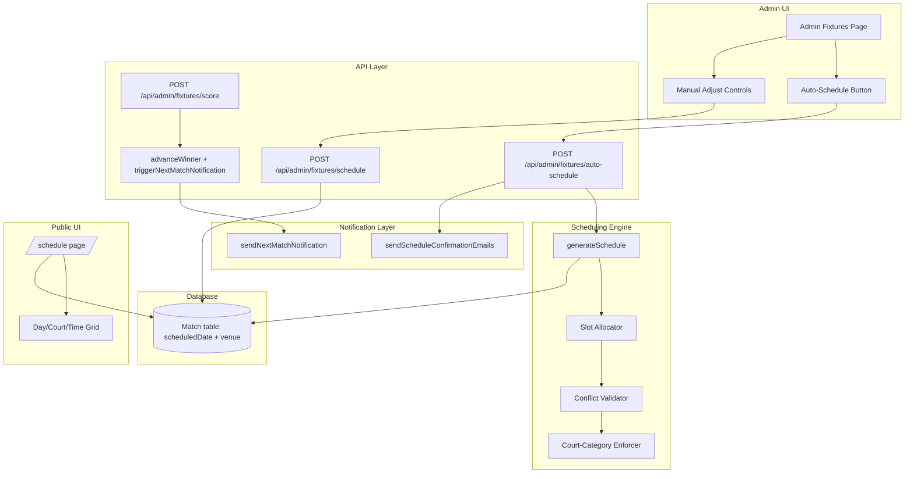

# Design Document: Pickleball Match Scheduling

## Overview

This feature adds intelligent court/time-slot scheduling for 79 real pickleball matches across 3 courts over 3 days (May 12–14, 2026, 5:00 PM–8:00 PM). It provides:

1. **Auto-scheduling engine** — assigns all playable matches to court+time combinations respecting category constraints, round ordering, and player conflict avoidance.
2. **Manual adjustment** — admin can reassign individual matches after auto-scheduling.
3. **Conflict validation** — prevents double-booking of courts and player time overlaps.
4. **Schedule confirmation with email notifications** — sends match details to players when both participants are confirmed.
5. **Next-match notifications** — automatically emails both players of a next-round match once both feeder matches complete.
6. **Public schedule display** — day/court/time grid view accessible without authentication.

The design reuses existing infrastructure: the `Match` model's `scheduledDate` and `venue` fields, the existing `sendMatchScheduledEmail` function, the bulk-schedule and single-schedule API routes, and the score recording route's winner-advancement logic.

## Architecture



### Key Design Decisions

1. **Store court in `venue` field as "Court 1", "Court 2", "Court 3"** — avoids schema changes, human-readable, consistent with existing usage.
2. **Store time slot as exact DateTime in `scheduledDate`** — e.g., `2026-05-12T17:00:00+05:30`. Existing field, no migration needed.
3. **Auto-schedule is a pure function** — takes matches + constraints, returns proposed assignments. Persisted only on admin confirmation.
4. **Next-match notification triggered inside score recording** — after `advanceWinner` completes, check if the next match now has both participants confirmed and a schedule assigned.
5. **Batch email sending with failure isolation** — each email send is wrapped in try/catch; failures are logged but don't block other sends.

## Components and Interfaces

### 1. Scheduling Engine (`src/lib/scheduling.ts`)

Pure logic module with no database dependencies (receives data, returns assignments).

```typescript
interface TimeSlot {
  date: string;        // "2026-05-12" | "2026-05-13" | "2026-05-14"
  startTime: string;   // "17:00" | "17:20" | ... | "19:40"
  slotIndex: number;   // 0-8 within the day
}

interface CourtSlot {
  court: string;       // "Court 1" | "Court 2" | "Court 3"
  timeSlot: TimeSlot;
}

interface ScheduleAssignment {
  matchId: string;
  court: string;
  scheduledDate: Date;  // Full ISO datetime
}

interface ScheduleConflict {
  type: "court_occupied" | "player_overlap" | "category_mismatch";
  matchId: string;
  details: string;
}

// Court-category mapping
const COURT_CATEGORIES: Record<string, string[]> = {
  "Court 1": ["MENS_SINGLES"],
  "Court 2": ["WOMENS_SINGLES", "WOMENS_DOUBLES", "MENS_SINGLES"],  // MS overflow
  "Court 3": ["MIXED_DOUBLES", "MENS_DOUBLES"],
};

function generateSchedule(
  matches: MatchForScheduling[],
  existingAssignments?: ScheduleAssignment[]
): { assignments: ScheduleAssignment[]; conflicts: ScheduleConflict[] };

function validateAssignment(
  assignment: ScheduleAssignment,
  allAssignments: ScheduleAssignment[],
  matches: MatchForScheduling[]
): ScheduleConflict[];

function getAvailableSlots(
  court: string,
  allAssignments: ScheduleAssignment[]
): CourtSlot[];
```

### 2. Auto-Schedule API (`src/app/api/admin/fixtures/auto-schedule/route.ts`)

```typescript
// POST /api/admin/fixtures/auto-schedule
// Request: { confirm?: boolean, sendNotifications?: boolean }
// Response (preview): { assignments: ScheduleAssignment[], summary: { totalMatches, byDay, byCourt } }
// Response (confirm): { scheduled: number, notified: number }
```

### 3. Enhanced Schedule API (`src/app/api/admin/fixtures/schedule/route.ts`)

Extends existing route with conflict validation before persisting.

### 4. Next-Match Notification Hook (in score route)

After `advanceWinner` completes, calls `checkAndNotifyNextMatch` which:
1. Finds the next match the winner was advanced into
2. Checks if both `entry1Id` and `entry2Id` are now real player IDs (not WINNER_ placeholders)
3. If the match has `scheduledDate` and `venue`, sends notification to both entries' players
4. If the match lacks a schedule, auto-assigns the next available slot on the appropriate court, then sends notification

### 5. Public Schedule View (`src/app/schedule/page.tsx`)

Adds a day/court/time grid view for pickleball when schedule data exists. Shows:
- Three-day tab navigation (May 12, 13, 14)
- Court columns within each day
- Time slots as rows (5:00 PM through 7:40 PM)
- Match cards showing category, players, status, and scores

### 6. Email Notification Functions (additions to `src/lib/email.ts`)

```typescript
// Send initial schedule notification (only to matches where both players confirmed)
async function sendScheduleConfirmationEmails(matchIds: string[]): Promise<{ sent: number; failed: number }>;

// Send next-match notification when both players become ready
async function sendNextMatchNotification(match: MatchForEmail): Promise<void>;
```

## Data Models

No schema changes required. The feature uses existing fields:

### Match Model (existing fields used)

| Field | Type | Usage |
|-------|------|-------|
| `scheduledDate` | `DateTime?` | Stores the exact start time of the match (e.g., `2026-05-12T17:00:00+05:30`) |
| `venue` | `String?` | Stores the court assignment as "Court 1", "Court 2", or "Court 3" |
| `notificationSent` | `Boolean` | Tracks whether the schedule notification email has been sent |
| `entry1Id` | `String?` | Player/team 1 reference — when not a WINNER_ placeholder, player is confirmed |
| `entry2Id` | `String?` | Player/team 2 reference — when not a WINNER_ placeholder, player is confirmed |
| `category` | `String?` | Pickleball category (MENS_SINGLES, WOMENS_SINGLES, etc.) |

### Court-Category Constraint Matrix

| Court | Primary Categories | Overflow |
|-------|-------------------|----------|
| Court 1 | MENS_SINGLES | — |
| Court 2 | WOMENS_SINGLES, WOMENS_DOUBLES | MENS_SINGLES (after Court 1 full) |
| Court 3 | MIXED_DOUBLES, MENS_DOUBLES | — |

### Time Slot Structure

| Day | Date | Slots | Times |
|-----|------|-------|-------|
| Day 1 | 2026-05-12 | 9 | 17:00, 17:20, 17:40, 18:00, 18:20, 18:40, 19:00, 19:20, 19:40 |
| Day 2 | 2026-05-13 | 9 | Same |
| Day 3 | 2026-05-14 | 9 | Same |

**Total capacity**: 3 courts × 3 days × 9 slots = 81 slots for 79 matches.


## Correctness Properties

*A property is a characteristic or behavior that should hold true across all valid executions of a system — essentially, a formal statement about what the system should do. Properties serve as the bridge between human-readable specifications and machine-verifiable correctness guarantees.*

### Property 1: Court Slot Uniqueness

*For any* set of schedule assignments produced by the scheduler (or validated by the conflict checker), no two matches shall be assigned to the same court and time slot combination.

**Validates: Requirements 1.3, 2.3, 7.1**

### Property 2: No Player Time Overlap

*For any* set of schedule assignments, no player shall appear in two different matches assigned to the same time slot.

**Validates: Requirements 7.2, 7.3**

### Property 3: Court-Category Constraint Enforcement

*For any* schedule assignment, the match's category must be in the allowed set for its assigned court: Court 1 allows only MENS_SINGLES; Court 2 allows WOMENS_SINGLES, WOMENS_DOUBLES, and MENS_SINGLES; Court 3 allows only MIXED_DOUBLES and MENS_DOUBLES.

**Validates: Requirements 1.5**

### Property 4: Only Playable Matches Scheduled

*For any* match included in the scheduler's output, both entry1Id and entry2Id must reference actual participants (not null, not bye indicators). Bye matches with only one participant are never scheduled.

**Validates: Requirements 1.4**

### Property 5: Schedule Completeness

*For any* set of playable matches (where both entries exist) that fits within the available capacity (81 slots), the auto-scheduler shall produce an assignment for every playable match.

**Validates: Requirements 2.1**

### Property 6: Round Ordering

*For any* two matches assigned to the same court where one is in a later round than the other, the later-round match must have a strictly later scheduled time.

**Validates: Requirements 2.2**

### Property 7: Men's Singles Overflow Priority

*For any* schedule output, if a MENS_SINGLES match is assigned to Court 2, then all Court 1 slots at or before that time slot must already be occupied by MENS_SINGLES matches.

**Validates: Requirements 2.4**

### Property 8: Chronological Fill Order

*For any* court in the schedule output, matches fill earlier days before later days, and within each day, earlier time slots before later time slots (no gaps before filled slots on the same court).

**Validates: Requirements 2.5**

### Property 9: Notification Trigger Condition

*For any* match in the bracket, a next-match notification is sent if and only if: (a) both entry1Id and entry2Id reference actual registered players (no WINNER_ prefixes), AND (b) the match has both scheduledDate and venue assigned.

**Validates: Requirements 4.2, 4.3, 4.4**

### Property 10: Doubles Recipient Completeness

*For any* doubles match notification, the recipient list must include all players from both entries (up to 4 players: 2 per entry for doubles categories).

**Validates: Requirements 4.5**

### Property 11: Auto-Assign on Both Ready

*For any* next-round match where both players become confirmed but the match lacks a scheduledDate or venue, the system shall auto-assign the next available time slot on the appropriate court (respecting category constraints) before sending the notification.

**Validates: Requirements 4.6**

### Property 12: Email Content Completeness

*For any* scheduled match notification email, the content must include the match date, start time, court number, category, and opponent name(s).

**Validates: Requirements 3.2**

### Property 13: Initial Notification References Earliest Match

*For any* player with multiple scheduled matches, the initial schedule confirmation notification shall reference only the earliest upcoming match.

**Validates: Requirements 3.4**

## Error Handling

### Scheduling Conflicts

| Error Condition | Response | Recovery |
|----------------|----------|----------|
| Court+time slot already occupied | 409 Conflict with details of existing match | Admin must choose different slot |
| Player time overlap detected | 409 Conflict with player name and conflicting match | Admin must reschedule one match |
| Category not allowed on court | 400 Bad Request with constraint explanation | Admin must choose correct court |
| Match is a bye (single participant) | 400 Bad Request | Admin cannot schedule bye matches |
| Time slot outside tournament window | 400 Bad Request | Admin must use valid date/time |

### Email Failures

- Each email send is wrapped in individual try/catch
- Failures are logged with match ID, recipient, and error details
- Processing continues for remaining recipients
- `notificationSent` is only set to `true` after successful send
- Admin can re-trigger notifications for failed matches via the UI

### Auto-Schedule Edge Cases

- If matches exceed capacity (>81 playable matches): return error with count, do not partially schedule
- If court-category constraints make scheduling impossible: return detailed conflict report showing which categories overflow

### Database Errors

- All schedule writes use individual `prisma.match.update` (not transactions) for resilience — partial success is acceptable
- Failed writes are logged and reported in the API response
- Admin can retry individual failed assignments

## Testing Strategy

### Property-Based Tests (using `fast-check`)

The scheduling engine (`src/lib/scheduling.ts`) is a pure function ideal for property-based testing. Each property from the Correctness Properties section maps to a `fast-check` test with minimum 100 iterations.

**Test file**: `src/lib/__tests__/scheduling.property.test.ts`

Properties to test:
1. Court slot uniqueness (Property 1)
2. No player time overlap (Property 2)
3. Court-category constraints (Property 3)
4. Only playable matches scheduled (Property 4)
5. Schedule completeness (Property 5)
6. Round ordering (Property 6)
7. Men's singles overflow priority (Property 7)
8. Chronological fill order (Property 8)
9. Notification trigger condition (Property 9)
10. Doubles recipient completeness (Property 10)
11. Auto-assign on both ready (Property 11)
12. Email content completeness (Property 12)
13. Initial notification references earliest match (Property 13)

**Generator strategy**: Generate random sets of pickleball matches with varying:
- Number of matches per category (1–20)
- Round numbers (1–5)
- Player IDs (to test overlap detection)
- Entry states (confirmed vs WINNER_ placeholder)

**Configuration**:
- Minimum 100 iterations per property
- Tag format: `Feature: pickleball-match-scheduling, Property N: <description>`

### Unit Tests (example-based)

**Test file**: `src/lib/__tests__/scheduling.test.ts`

- Valid court/time assignment accepted
- Invalid time (outside 5–8 PM) rejected
- Invalid date (outside May 12–14) rejected
- Clearing a schedule (null values) works
- Preview mode returns assignments without persisting
- Confirm mode persists and returns count

### Integration Tests

**Test file**: `src/app/api/admin/fixtures/__tests__/auto-schedule.test.ts`

- Auto-schedule API requires ADMIN role
- Auto-schedule with real match data produces valid output
- Schedule confirmation sends emails (mocked)
- Score recording triggers next-match notification when both ready
- Score recording does NOT trigger notification when one side is TBD
- Email failure doesn't block other sends

### E2E / Smoke Tests

- Public schedule page loads without authentication
- Schedule page shows day/court/time grid when data exists
- Admin can trigger auto-schedule and see preview
- Admin can confirm schedule

### Resource Efficiency Considerations (Vercel Hobby / Neon Free Tier)

- Auto-schedule computation is done in-memory (no extra DB queries during generation)
- Bulk email sending uses sequential sends with small delays to avoid rate limits
- Schedule page uses `revalidate = 30` for ISR caching
- No real-time subscriptions — polling-based updates only
